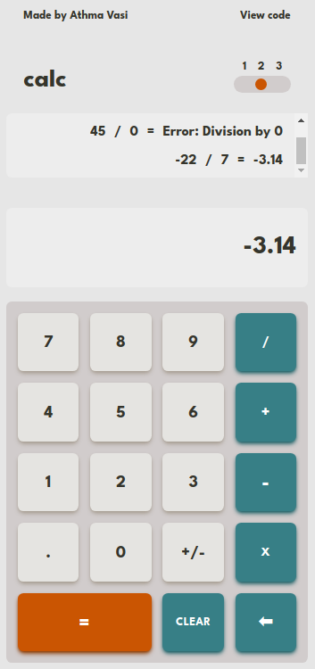
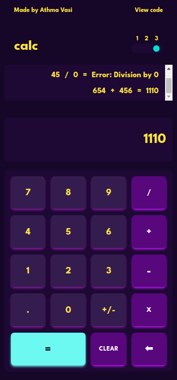
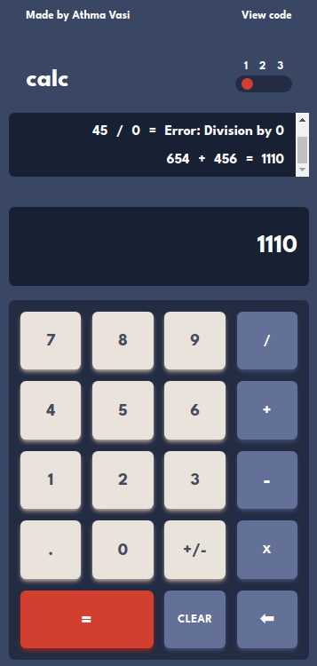

# Calculator App

This application is a user-friendly calculator that can be used to perform basic arithmetic operations. It provides two input options: the user may input numbers through the calculator's dedicated number buttons, or alternatively, through the keyboard input function. The application keeps a record of all previous calculations and continually updates the history display.

This is a project for the [Odin Project](https://www.theodinproject.com/courses/web-development-101/lessons/calculator) curriculum.

This is a remake of my [previous calculator project](https://github.com/Athma-Vasi/Calculator), which was built using HTML, CSS, and TypeScript. I was able to learn a lot from that project, however I wanted to try my hand at building a calculator using React.

#### Screenshots

  
  
  

#### Technologies used

- [React](https://react.dev/)
- [TypeScript](https://www.typescriptlang.org/)
- [Tailwind CSS](https://tailwindcss.com/)
- [Create-T3-App](https://create-t3-app-docs.vercel.app/en/introduction)
- [tailwind-styled-components](https://www.npmjs.com/package/tailwind-styled-components)
- [Cypress](https://www.cypress.io/)
- [Next.js](https://nextjs.org/)
- [Vercel](https://vercel.com/)

This is a challenge from [frontendmentor](https://www.frontendmentor.io/challenges/calculator-app-9lteq5N29). However, the assets were only available for premium members. I used the colour picker tool in firefox to grab the colours (≧▽≦).

**Here is the challenge brief**

Your challenge is to build out this calculator app and get it looking as close to the design as possible.

You can use any tools you like to help you complete the challenge. So if you've got something you'd like to practice, feel free to give it a go.

Your users should be able to:

- See the size of the elements adjust based on their device's screen size
- Perform mathematical operations like addition, subtraction, multiplication, and division
- Adjust the color theme based on their preference

Download the project and go through the README.md file. This will provide further details about the project and help you get set up.
